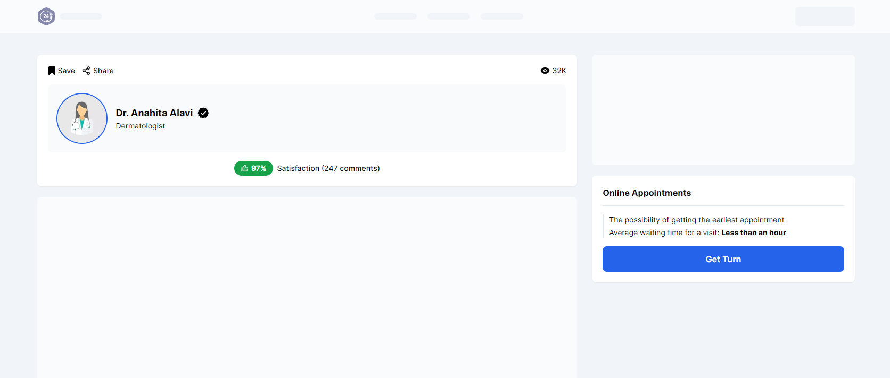
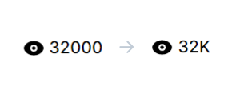
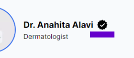

## Paziresh24 FrontEnd Assessment



### Setup

1. Fork this repository
2. Clone your forked repository
3. Start project

```bash
npm i

npm start
```

> **_NOTE_**: Commit your code in appropriate situations based on [Conventional Commits](https://www.conventionalcommits.org/).

## Tasks

### 🦚 Add Tailwind CSS

---

### 🦋 Review code with Clean Code principles

`File names and variables must follow the same rules.`
`Folder structure must follow the same rules.`
`...`

---

### 🎫 Service Card `src/components/service`


> Refactor the section to convert waiting time to waiting time text

**💥so that there is no need for useEffect and useState.**

| waiting time | waiting time text      |
| ------------ | ---------------------- |
| 0            | Less than half an hour |
| 1            | Less than an hour      |
| 2            | Less than two hours    |
| 3            | More than two hours    |

---

### 👩‍⚕️ Doctor Head


### Develop the UI of this Card

> Give the required data of this card through the `props` in the `App.js` file

### Perform the logical tasks below.

#### 1. View Count

> Number formatting: 32000 👉 32K



#### 2. Save Button

###### Implement the save button

> Show the default value

> By click on the button, its status can be changed as a toggle


#### 3. Share Button

> By click the button, the sharing window will be displayed

The doctor's name should be included in the **title**


#### 4. Conditional rendering for show trust icon



| Property      | Condition                            |
| ------------- | ------------------------------------ |
| satisfaction  | > 90%                                |
| commentsCount | >= 100                               |
| waitingTime   | == 1 Or the same "Less than an hour" |

---

### 🎯 Deploy `Plus`

> Deploy the project to **Vercel** or **Netlify** services.

---

### Hooray congratulations 🎉
